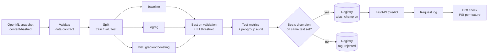

# ml-workflow

An end-to-end MLOps workflow for a tabular classifier: validated data, tracked experiments,
a promotion gate in a model registry, a prediction API and drift monitoring, all orchestrated
and containerised.

The task is the UCI Adult census dataset (48,842 people, predict income > $50K). The data is
deliberately a familiar one: the point of the project is everything *around* the model.



| Piece | Tool |
|---|---|
| Orchestration, retries, schedules | Prefect 3 (`train-and-promote` weekly, `drift-check` hourly) |
| Experiment tracking, model registry | MLflow 3 (SQLite backend, proxied artifact store) |
| Models | scikit-learn pipelines (preprocessing is inside the saved model) |
| Serving | FastAPI with pydantic input validation, hot reload of the champion |
| Web app | Single-page UI served by the API: predict, inspect the model, simulate traffic, check drift, retrain |
| Monitoring | Population Stability Index on every feature against the training data |
| Packaging, CI | Docker Compose, GitHub Actions (ruff, pytest, image build) |

## Results

One pipeline run (seed 42, 31,258 train / 7,815 validation / 9,769 test rows):

| Candidate | Val ROC-AUC | Val PR-AUC | Val F1 | Val Brier |
|---|---|---|---|---|
| baseline (predicts base rate) | 0.500 | 0.239 | 0.386 | 0.182 |
| logistic regression | 0.907 | 0.770 | 0.696 | 0.101 |
| **hist. gradient boosting** | **0.930** | **0.834** | **0.732** | **0.087** |

Selected model on the held-out test set, at the F1-optimal threshold chosen on validation (0.33):
**ROC-AUC 0.929, PR-AUC 0.833**, F1 0.727, precision 0.667, recall 0.800, accuracy 0.856.

### Per-group audit

`race` and `sex` are **not** model inputs. They are kept only to audit the model per group:

| Group | n | Base rate | ROC-AUC | Predicted positive | Precision | Recall |
|---|---|---|---|---|---|---|
| Female | 3,259 | 0.111 | 0.948 | 0.119 | 0.669 | **0.718** |
| Male | 6,510 | 0.304 | 0.912 | 0.371 | 0.666 | **0.815** |
| White | 8,312 | 0.253 | 0.926 | 0.305 | 0.668 | 0.804 |
| Black | 968 | 0.133 | 0.960 | 0.150 | 0.676 | 0.760 |
| Asian-Pac-Islander | 311 | 0.264 | 0.900 | 0.315 | 0.653 | 0.781 |

Removing `sex` from the inputs does not make the model blind to it. Precision is the same for
women and men, but **recall is 10 points lower for women**: high earners who are women get
missed more often. `relationship` (Husband/Wife) is an almost perfect proxy for sex. Whether
this gap matters depends on how the score is used. The pipeline's job is to measure and log it
on every run (`slice_metrics.csv` in each MLflow run) so that it can't go unnoticed. Groups
with fewer than 100 test rows are omitted here; their numbers are too noisy to read.

### Promotion gate

A challenger is promoted only if it beats the current champion by at least 0.002 ROC-AUC.
Both are scored **live on the same test set**, not compared against a stored number. Every
candidate is still registered and tagged `accepted` or `rejected`, so the registry keeps a
full history. Re-running the pipeline unchanged gives:

```json
{"version": "2", "candidate": "hgb", "challenger": 0.929, "champion": 0.929, "promoted": false}
```

### Drift detection

`mlwf traffic` replays 1,000 held-out rows through the API, which logs every request.
`--drift` simulates an older, longer-working population (age +15, hours x1.3):

| Feature | PSI, clean traffic | PSI, shifted traffic |
|---|---|---|
| age | 0.007 | **2.559** |
| hours-per-week | 0.008 | **1.895** |
| every other feature | ≤ 0.042 | ≤ 0.042 |

Only the two shifted features cross the 0.2 threshold, and clean traffic raises no alert.

## Design decisions

- **Reproducible data.** The OpenML download is cached as parquet and content-hashed. The hash
  is logged with every run, so any metric can be traced to the exact data behind it.
- **Data contract before training.** Schema, value ranges, null rates and a binary target are
  checked first. A violation stops the flow; minor issues (5.8% missing `occupation`, 52
  duplicate rows) are logged as warnings.
- **No training/serving skew.** Imputation, one-hot encoding and scaling live inside the saved
  sklearn `Pipeline`, so the API runs exactly the transformation that was evaluated. Unseen
  and rare categories go to a shared "infrequent" bucket instead of crashing the service.
- **Honest model selection.** Candidates and the decision threshold are chosen on validation
  only; the test set is used once per run, for the final numbers and the gate. A dummy
  baseline is always trained, so every result has a floor to compare against.
- **`fnlwgt` dropped.** It is a census sampling weight, not a property of the person.
- **Safe model loading.** MLflow 3.16 serialises models with skops, which refuses to load
  unknown types. The few extra types the pipeline needs are declared explicitly in
  `SKOPS_TRUSTED_TYPES`, instead of falling back to pickle.
- **Registry aliases, not stages.** The API loads `models:/adult-income@champion`, and
  `POST /reload` picks up a newly promoted version without a restart.

## Web app

The API also serves a browser UI at http://localhost:8000 with three tabs:

- **Predict:** fill in a person, or load a real one from the held-out test set to see the
  prediction next to what actually happened. The probability is shown against the decision threshold.
- **Model:** the serving champion's test metrics, the candidate comparison, the registry history
  with each version's gate decision, and the per-group audit. **Retrain** runs the full
  train-and-promote flow in the background and reports whether the new version was promoted.
- **Monitoring:** replay 500 held-out people as normal or shifted traffic, run the drift check,
  and see the PSI of every feature against the 0.2 threshold.

## Running it

Requires [Docker Desktop](https://www.docker.com/products/docker-desktop/). Everything runs in
containers; no local Python environment is needed.

**One click (Windows):** double-click `start.bat`. It starts Docker Desktop if needed, brings up
MLflow, Prefect and the web app, trains the first model if none exists yet, and opens
http://localhost:8000. The first run builds the image and takes a few minutes; later starts take
seconds. `stop.bat` stops everything; models, runs and data are kept in Docker volumes and `data/`.

**Manually (any OS):**

```bash
docker compose up -d --build
```

This starts MLflow on http://localhost:5000, Prefect on http://localhost:4200 and the web app on
http://localhost:8000 (API docs at `/docs`). The same steps the UI offers are available from the
command line:

```bash
docker compose run --rm jobs mlwf train
```

```bash
curl -X POST localhost:8000/reload
```

```bash
docker compose run --rm jobs mlwf traffic --api-url http://api:8000 -n 1000 --drift
```

```bash
docker compose run --rm jobs mlwf drift
```

```bash
docker compose run --rm jobs pytest
```

To run both flows on their schedules (weekly retrain, hourly drift check), start the scheduler:

```bash
docker compose --profile scheduler up -d scheduler
```

Example request:

```bash
curl -X POST localhost:8000/predict -H "content-type: application/json" -d '{"records":[{"age":45,"workclass":"Private","education":"Bachelors","education-num":13,"marital-status":"Married-civ-spouse","occupation":"Exec-managerial","relationship":"Husband","capital-gain":0,"capital-loss":0,"hours-per-week":50,"native-country":"United-States"}]}'
```

## Layout

```
configs/pipeline.yaml     candidates, hyperparameters, split, promotion and drift thresholds
src/mlworkflow/
  data.py                 ingestion, content hash, stratified split
  validate.py             data contract
  features.py             preprocessing + model pipelines
  evaluate.py             metrics, threshold choice, per-group audit
  registry.py             champion lookup and loading
  pipeline.py             Prefect flows: train-and-promote, drift-check
  monitor.py              PSI drift report
  api.py                  FastAPI service, request logging, web app endpoints
  web/index.html          browser UI (plain HTML/JS, no build step)
  cli.py                  mlwf train | drift | traffic | schedule
scripts/start.ps1         one-click start (called by start.bat)
tests/                    23 tests: validation, models, drift, API, web endpoints (no services needed)
```

## Limitations and next steps

- Adult is a static 1994 dataset with no labels arriving over time, so drift is detected but
  retraining can't use fresh data. In production the drift flow would trigger
  `train-and-promote` on newly labelled data, and performance monitoring would follow once
  labels arrive.
- Each run uses a single train/val/test split. Cross-validated selection and confidence
  intervals on the gate comparison (e.g. a bootstrap) would make promotion decisions more
  robust to noise.
- Hyperparameters are fixed in the config; a tuning step (e.g. Optuna logging to MLflow)
  would slot in as another task.
- The request log is a local JSONL file. A real deployment would write to a queue or a table.
