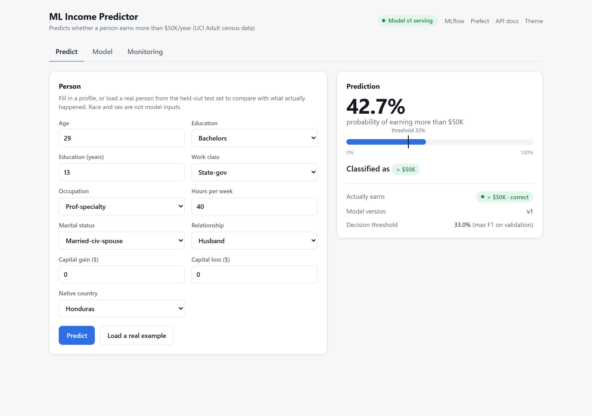
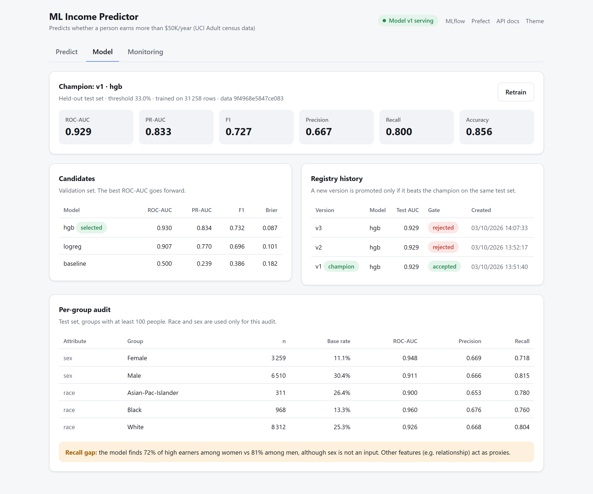
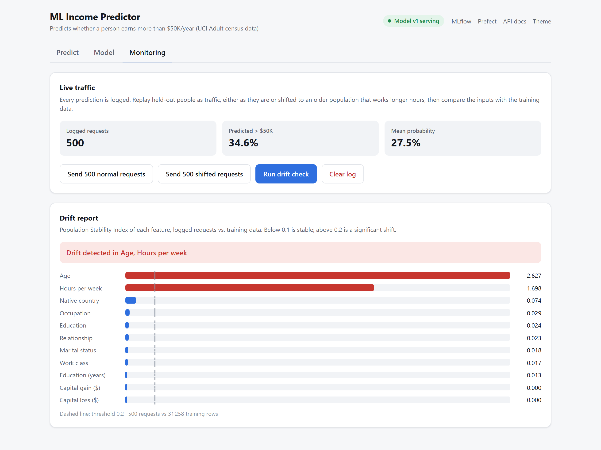
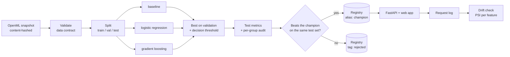

# ML Income Predictor

[](https://github.com/Adversitas/ML-income-predictor/actions/workflows/ci.yml)


**A production-style machine learning system, end to end: from raw data to a monitored model in a web app.**

It predicts whether a person earns more than $50K a year from US census data. The model
itself is deliberately a standard one. The project is about everything around it: data
checks, experiment tracking, a model registry with a promotion gate, a prediction API, drift
monitoring, a fairness audit and scheduled retraining. Everything starts with one click.



## Highlights

- **0.929 ROC-AUC** on held-out data with gradient boosting, against 0.907 for logistic
  regression and 0.500 for a baseline that always guesses the average.
- **A promotion gate.** A newly trained model replaces the one in production only if it scores
  better on the same test data. Every version is kept in the registry and marked accepted or
  rejected.
- **A fairness audit on every run.** Sex and race are not given to the model, yet the audit
  shows it finds **72% of high earners among women vs 81% among men**. Other features act as
  stand-ins for sex. The audit reports the gap instead of hiding it.
- **Drift detection.** Every request is logged and compared with the training data. Shifted
  traffic is flagged on exactly the features that changed; normal traffic raises no alert.
- **One-click start.** `start.bat` starts Docker, the services and a first training run, then
  opens the app.

## Quick start

You need [Docker Desktop](https://www.docker.com/products/docker-desktop/). Everything else
runs in containers, so there is no Python environment to set up.

```bash
git clone https://github.com/Adversitas/ML-income-predictor.git
```

**Windows:** double-click **`start.bat`** in the cloned folder. It:

1. starts Docker Desktop if it isn't running,
2. starts MLflow, Prefect and the web app,
3. trains the first model if none exists yet,
4. opens http://localhost:8000.

The first start builds the image and takes a few minutes; later starts take seconds.
**`stop.bat`** stops everything. Models, run history and data are kept.

**macOS / Linux:** run these from the cloned folder.

```bash
docker compose up -d --build
```

```bash
docker compose run --rm jobs mlwf train
```

```bash
curl -X POST localhost:8000/reload
```

Then open http://localhost:8000.

| Service | URL |
|---|---|
| Web app | http://localhost:8000 |
| API docs (Swagger) | http://localhost:8000/docs |
| MLflow (experiments, registry) | http://localhost:5000 |
| Prefect (flow runs, schedules) | http://localhost:4200 |

## The web app

**Predict:** fill in a profile, or load a real person from the held-out test set and compare the
prediction with what actually happened (screenshot above). The probability is shown against
the decision threshold.

**Model:** the model currently in production and its test scores, how the three candidates
compared, every registered version with its gate decision, and the per-group audit.
**Retrain** runs the full pipeline in the background (about 20 seconds) and reports whether
the new version was promoted.



**Monitoring:** replay 500 held-out people as normal traffic, or shifted to an older
population that works longer hours. Then run the drift check, which compares each feature with
the training data.



## How it works



| Piece | Tool |
|---|---|
| Orchestration, retries, schedules | Prefect 3: `train-and-promote` weekly, `drift-check` hourly |
| Experiment tracking, model registry | MLflow 3 (SQLite backend, proxied artifact store) |
| Models | scikit-learn pipelines, with preprocessing saved inside the model |
| Serving | FastAPI with input validation; picks up a new champion without a restart |
| Web app | One HTML page served by the API, no build step |
| Monitoring | Population Stability Index (PSI) on every feature |
| Packaging, CI | Docker Compose; GitHub Actions runs ruff, pytest and the image build |

## Results

Data: the [UCI Adult](https://archive.ics.uci.edu/dataset/2/adult) census dataset, 48,842
people. Split with seed 42 into 31,258 train, 7,815 validation and 9,769 test rows.

### Model comparison (validation set)

| Candidate | ROC-AUC | PR-AUC | F1 | Brier |
|---|---|---|---|---|
| baseline (always predicts the base rate) | 0.500 | 0.239 | 0.386 | 0.182 |
| logistic regression | 0.907 | 0.770 | 0.696 | 0.101 |
| **gradient boosting** | **0.930** | **0.834** | **0.732** | **0.087** |

On the held-out test set, gradient boosting scores **ROC-AUC 0.929 and PR-AUC 0.833**. At the
decision threshold chosen on validation (33%, the one that maximises F1), it gets precision
0.667, recall 0.800 and accuracy 0.856.

### Per-group audit (test set)

| Group | n | Base rate | ROC-AUC | Predicted positive | Precision | Recall |
|---|---|---|---|---|---|---|
| Women | 3,259 | 11.1% | 0.948 | 11.9% | 0.669 | **0.718** |
| Men | 6,510 | 30.4% | 0.912 | 37.1% | 0.666 | **0.815** |
| White | 8,312 | 25.3% | 0.926 | 30.5% | 0.668 | 0.804 |
| Black | 968 | 13.3% | 0.960 | 15.0% | 0.676 | 0.760 |
| Asian-Pac-Islander | 311 | 26.4% | 0.900 | 31.5% | 0.653 | 0.781 |

Leaving `sex` out of the inputs does not make the model blind to it. Precision is the same for
women and men, but recall is 10 points lower for women: women who earn more than $50K are
missed more often. `relationship` (Husband/Wife) is an almost perfect stand-in for sex.
Whether the gap matters depends on how the score is used. The pipeline's job is to measure it
on every run and save it with the run (`slice_metrics.csv` in MLflow), so it can't go
unnoticed. Groups with fewer than 100 test rows are left out because their numbers are too
noisy.

### Promotion gate

A challenger is promoted only if it beats the current champion by at least 0.002 ROC-AUC.
Both are scored **live on the same test set**, not against a number stored earlier. Retraining
without changes produces an identical model, which is correctly rejected:

```json
{"version": "2", "candidate": "hgb", "challenger": 0.929, "champion": 0.929, "promoted": false}
```

### Drift detection

1,000 held-out people sent as traffic, first as they are, then shifted (age +15, hours ×1.3):

| Feature | PSI, normal traffic | PSI, shifted traffic |
|---|---|---|
| age | 0.007 | **2.559** |
| hours-per-week | 0.008 | **1.895** |
| every other feature | ≤ 0.042 | ≤ 0.042 |

Only the two shifted features cross the 0.2 alert threshold.

## Design decisions

- **Reproducible data.** The download is cached and fingerprinted. The fingerprint is logged
  with every run, so any score can be traced to the exact data behind it.
- **Data checks before training.** Columns, value ranges, missing values and the target are
  checked first. A real problem stops the run; minor ones (5.8% missing `occupation`, 52
  duplicate rows) are logged as warnings.
- **No training/serving mismatch.** Missing-value handling, encoding and scaling are saved
  inside the model, so the API applies exactly the steps that were evaluated. Categories
  never seen in training go to a shared "rare" bucket instead of crashing the service.
- **Honest evaluation.** Candidates and the threshold are chosen on validation data only. The
  test set is used once per run, for the final scores and the gate. A baseline is always
  trained so every score has a floor to compare against.
- **`fnlwgt` dropped.** It is a census sampling weight, not a property of the person.
- **Safe model files.** MLflow 3.16 saves models with skops, which refuses to load unknown
  code. The pipeline declares the few extra types it needs (`SKOPS_TRUSTED_TYPES`) instead of
  falling back to pickle.
- **Registry aliases.** The API serves `models:/adult-income@champion`. Promoting a new
  version and calling `POST /reload` switches models without a restart.

## Command line

Everything the web app does is also available as a command:

| Command | What it does |
|---|---|
| `docker compose run --rm jobs mlwf train` | run the full pipeline once |
| `docker compose run --rm jobs mlwf traffic --api-url http://api:8000 -n 1000 --drift` | send held-out people to the API (`--drift` shifts them) |
| `docker compose run --rm jobs mlwf drift` | compare logged requests with the training data |
| `docker compose --profile scheduler up -d scheduler` | retrain weekly and check drift hourly |
| `docker compose run --rm jobs pytest` | run the tests |

Example API request:

```bash
curl -X POST localhost:8000/predict -H "content-type: application/json" -d '{"records":[{"age":45,"workclass":"Private","education":"Bachelors","education-num":13,"marital-status":"Married-civ-spouse","occupation":"Exec-managerial","relationship":"Husband","capital-gain":0,"capital-loss":0,"hours-per-week":50,"native-country":"United-States"}]}'
```

```json
{"model_version": "1", "threshold": 0.3296, "predictions": [{"probability": 0.8246, "label": 1}]}
```

## Project layout

```
configs/pipeline.yaml     models, hyperparameters, split, gate and drift thresholds
src/mlworkflow/
  data.py                 download, fingerprint, stratified split, traffic sampling
  validate.py             data checks
  features.py             preprocessing and model pipelines
  evaluate.py             metrics, threshold choice, per-group audit
  registry.py             finding and loading the champion
  pipeline.py             Prefect flows: train-and-promote, drift-check
  monitor.py              PSI drift report
  api.py                  prediction API, request log, web app endpoints
  web/index.html          the web app
  cli.py                  mlwf train | drift | traffic | schedule
scripts/start.ps1         one-click start (run by start.bat)
tests/                    23 tests; they need no running services
```

## Limitations and next steps

- Adult is a static 1994 dataset with no new labels arriving, so drift can be detected but
  retraining has no fresh data to learn from. In production, the drift check would trigger
  retraining on newly labelled data, and accuracy monitoring would start once labels arrive.
- Each run uses a single train/validation/test split. Cross-validation, and confidence
  intervals on the gate comparison (e.g. a bootstrap), would make promotion decisions less
  sensitive to noise.
- Hyperparameters are fixed in the config. A tuning step (e.g. Optuna logging to MLflow) would
  fit in as another pipeline task.
- The request log is a local file. A real deployment would write to a queue or a database.

## Data

UCI Adult dataset by Barry Becker and Ronny Kohavi (1996), from the
[UCI Machine Learning Repository](https://archive.ics.uci.edu/dataset/2/adult), licensed
CC BY 4.0. It is downloaded through OpenML on the first run and is not stored in this
repository.
